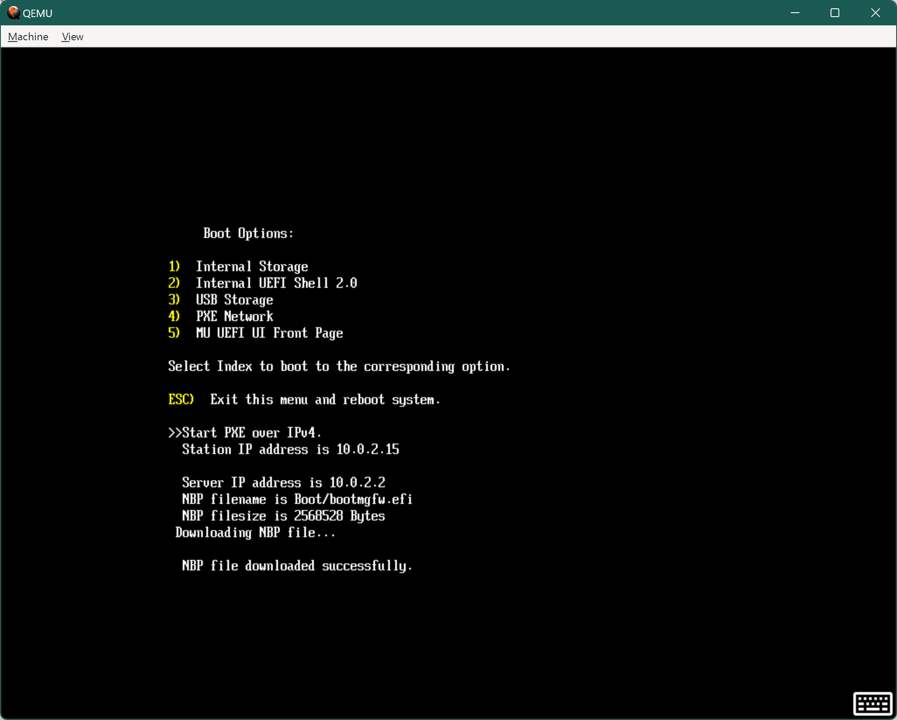

# PXE Boot Emulation

PXE Boot is a standard feature to boot an agent via network. A detailed rundown can be found at this [Tianocore page](https://github.com/tianocore/tianocore.github.io/wiki/PXE).

## PXE Boot Preparation

QEMU supports TFTP server hosting, which allows us to PXE boot a QEMU VM. To do this, one would need a prepared PXE folder
available to the QEMU launching instance.

For more detailed information on preparing a folder for booting Windows PE PXE boot, please refer to the
[Microsoft PXE server setup documentation](https://learn.microsoft.com/en-us/windows/deployment/configure-a-pxe-server-to-load-windows-pe).

*Note*: when preparing for the BCD, please use the following command to point the correct boot loader to the following
efi file (instead of the exe file as mentioned in the documentation):

```bash
bcdedit.exe /store c:\BCD /set {GUID1} path \windows\system32\winload.efi
```

The boot file for TFTP offering should also be pointing to `bootmgfw.efi`, which needs to be copied from `mount\Windows\Boot\EFI\bootmgfw.efi` in the Windows PE image folder.

### Configuring QEMU PXE Windows Boot on Linux Host

Due to the lack of path normalization support on QEMU TFTP server, starting from the normal Windows PXE setup, the Windows PXE boot files need to be updated with the following tricks:

- `BCD` file needs to be renamed to `Boot\BCD`
- `boot.wim` file needs to be renamed to `\boot.wim`
- `boot.sdi` file needs to be renamed to `\boot.sdi`
- `bootmgfw.efi` file needs to be renamed to `\bootmgfw.efi`

Then update the corresponding BCD settings to follow the new file names, i.e.:

```txt
Windows Boot Manager
--------------------
identifier              {bootmgr}
description             boot manager
displayorder            {Your Own GUID}
timeout                 30

Windows Boot Loader
-------------------
identifier              {Your Own GUID}
device                  ramdisk=[boot]\boot.wim,{ramdiskoptions}
path                    \windows\system32\winload.efi
description             winpe boot image
osdevice                ramdisk=[boot]\boot.wim,{ramdiskoptions}
systemroot              \windows
detecthal               Yes
winpe                   Yes

Setup Ramdisk Options
---------------------
identifier              {ramdiskoptions}
description             Ramdisk options
ramdisksdidevice        boot
ramdisksdipath          \boot.sdi
```

## Enable Local PXE Boot

To enable the QEMU PXE boot option, please specify the following parameters, either through command line or through the
`BuildConfig.conf` file:

| Name | Usage | Example |
| --- | --- | --- |
| `LOCAL_PXE_BOOT` | Flag to enable PXE booting | `LOCAL_PXE_BOOT=TRUE` |
| `PXE_FOLDER_PATH` | Folder path to the prepared PXE boot files | `PXE_FOLDER_PATH="D:\\Boot"` |
| `PXE_BOOT_FILE` | File path to the initial download | `PXE_BOOT_FILE="bootmgfw.efi"` |
| `PXE_OPTION_ROM` | File path to the initial download, required for SBSA PXE boot, see [instruction below](#customized-pxe-driver) | `PXE_BOOT_FILE="ipxe/src/bin-arm64-efi/808610d3.efirom"` |

This will allow the QEMU to set up a TFTP server and reply a default boot file to download when PXE boot is requested.
The network driver in this case is set to e1000.

Once the system booted, the default boot option will land in the UEFI Shell. One can exit the UEFI shell and select the
Boot Options from the boot menu and choose to PXE boot from there.



## Troubleshooting Tips

### Network Traffic

QEMU has provided a way of collecting network traffic. To do so, one can append the following parameter to the QEMU launching
command in [QemuRunner.py](../../../QemuQ35Pkg/Plugins/QemuRunner/QemuRunner.py#L88):

```py
"-object filter-dump,id=f1,netdev=net0,file=dump.dat"
```

Where the `dump.dat`, of which name is subject to users' choice, is the file to store the network traffic. This file can
be opened by Wireshark to analyze the network traffic. Please note that the `netdev` should match the NIC driver added for
PXE boot.

### Customized PXE Driver

QEMU leverages iPXE as the NIC driver for its e1000 device. To customize the iPXE driver, i.e. in the case of updating the
driver to enable NX flag and/or paging alignment, one can follow the steps below:

- One can refer to the QEMU usage for building iPXE from their make file [here](https://github.com/qemu/qemu/blob/master/roms/Makefile).
However, it is essentially doing the following, where the output *.efirom will be our target. Note that one will need
EfiRom from our [BaseTools](https://github.com/microsoft/mu_basecore/tree/release/202302/BaseTools) for the below
commands to work. For Q35, we enable e1000:

```bash
cd ipxe/src
make veryclean
make bin-x86_64-efi/8086100e.efidrv -j 4 CONFIG=qemu
cd ../..
MU_BASECORE/BaseTools/Bin/Mu-Basetools_extdep/Linux-x86/EfiRom -f "0x8086" -i "0x100e" -l 0x02 -ec bin-x86_64-efi/8086100e.efidrv -o bin-x86_64-efi/8086100e.efirom
```

- For SBSA, the e1000e is supported. However, this is not included with a default QEMU build. Thus the following commands can be used,
assuming that the `GCC5_AARCH64_PREFIX` is already set during the SBSA UEFI build:

```bash
cd src
make veryclean
make bin-arm64-efi/808610d3.efidrv -j 4 CONFIG=qemu CROSS_COMPILE=${GCC5_AARCH64_PREFIX}
/home/test/mu_tiano_platforms/MU_BASECORE/BaseTools/Bin/Mu-Basetools_extdep/Linux-x86/EfiRom -f "0x8086" -i "0x10d3" -l 0x02 -ec bin-arm64-efi/808610d3.efidrv -o bin-arm64-efi/808610d3.efirom
${GCC5_AARCH64_PREFIX}objdump -d bin-arm64-efi/808610d3.efidrv.tmp > ../out_dism.log
```

- Once we have our own NIC driver, to apply the new option rom to the QEMU launching instance, one can specify the following
parameter in [QemuRunner.py](../../../QemuQ35Pkg/Plugins/QemuRunner/QemuRunner.py#L88) when configuring the netowork device:

```py
",romfile=<path_to_your_8086100e.efirom>"
```
