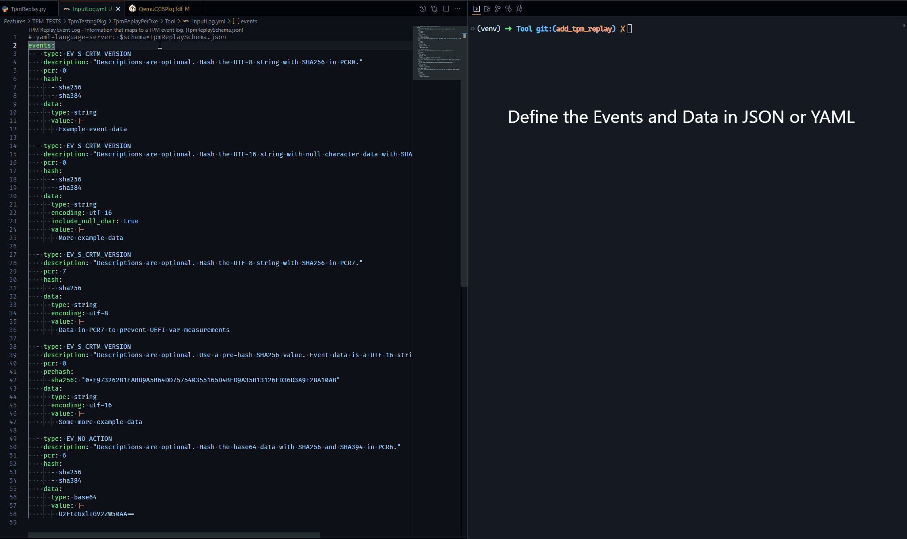
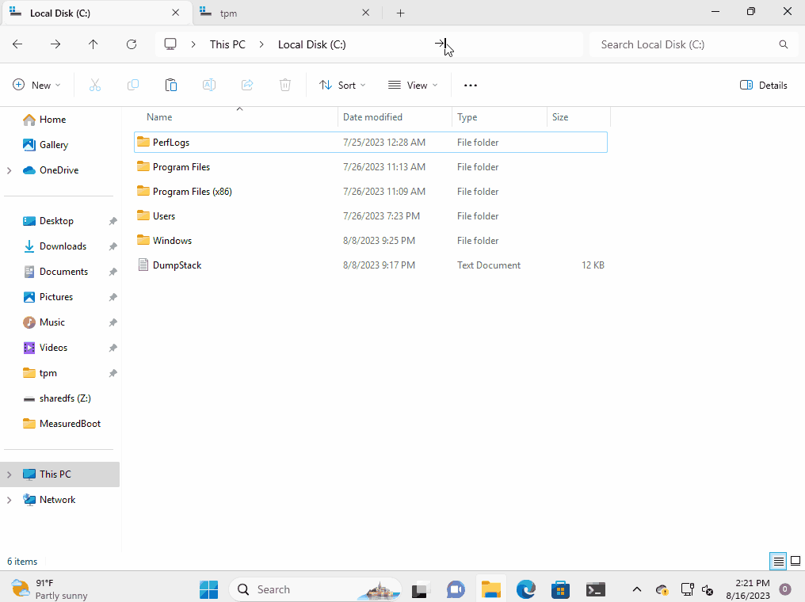

# TPM Replay

## Overview

This feature provides the ability to replay TPM measurements from a custom-made event log. The primary purpose is for
testing operating system features dependent on measurements. This feature allows OS (and FW) developers to easily
create scenarios like edge cases and bug repros related to measurements from firmware with minimal overhead.

For more information about the generic TPM replay feature including how it interacts with the TPM, visit the
[TPM Replay documentation](https://github.com/microsoft/mu_plus/blob/HEAD/TpmTestingPkg/TpmReplayPei/Readme.md).

## TPM Replay in QEMU

Since TPM Replay changes the default behavior for extending TPM measurements from UEFI firmware, it is disabled by
default. It can be enabled either by changing the `TPM_REPLAY_ENABLED` value to `TRUE` in the platform DSC file:

```ini
  DEFINE TPM_REPLAY_ENABLED = TRUE
```

Or, as a `stuart_build` argument:

```bash
> stuart_build -c Platforms/QemuQ35Pkg/PlatformBuild.py --flashrom TOOL_CHAIN_TAG=GCC5 BLD_*_TPM_ENABLE=TRUE \
               BLD_*_TPM_REPLAY_ENABLED=TRUE TPM_DEV=/tmp/mytpm1/swtpm-sock
```

Note that the TPM driver stack is also disabled by default in QEMU firmware. It requires a TPM emulator and currently
has only been enabled/tested on Linux. The command above also shows how to enable TPM. For more information about
enabling TPM, refer to the [TPM feature readme document](feature_tpm.md).

> The `# yaml-language-server: $schema=<schemapath>` modeline at the top of the file points to the schema
> for the TPM Replay event log. Eventually, the schema is planned to be submitted to the
> [JSON Schema Store](https://www.schemastore.org/json/). That is on hold while the final schema materializes.
>
> After that happens, popular YAML tools like the [Red Hat YAML extension for VS Code](https://marketplace.visualstudio.com/items?itemName=redhat.vscode-yaml)
> will automatically apply the schema. Until then, the file needs to be referenced at the top of the file as shown
> below to get the benefits of IDE documentation and YAML validation.
>
> The URL is provided in the example since that will be constant across machines, a local relative (to the YAML file)
> or absolute path is also acceptable.

## Creating a TPM Replay Event Log

Event logs can be created in either a YAML or JSON file.

Here's a quick example of a YAML event log description file. It is intended to show a variety of different keywords
and options to define event entries.

```yaml
# yaml-language-server: $schema=https://raw.githubusercontent.com/microsoft/mu_plus/HEAD/TpmTestingPkg/TpmReplayPei/Tool/TpmReplaySchema.json
events:

  - type: EV_S_CRTM_VERSION
    description: "Descriptions are optional. Hash the UTF-8 string with SHA256 in PCR0."
    pcr: 0
    hash:
      - sha256
      - sha384
    data:
      type: string
      value: |-
        Example event data

  - type: EV_S_CRTM_VERSION
    description: "Descriptions are optional. Hash the UTF-16 string with null character data with SHA256 & SHA384 in PCR0."
    pcr: 0
    hash:
      - sha256
      - sha384
    data:
      type: string
      encoding: utf-16
      include_null_char: true
      value: |-
        More example data

  - type: EV_S_CRTM_VERSION
    description: "Descriptions are optional. Hash the UTF-8 string with SHA256 in PCR7."
    pcr: 7
    hash:
      - sha256
    data:
      type: string
      encoding: utf-8
      value: |-
        Data in PCR7 to prevent UEFI var measurements

  - type: EV_S_CRTM_VERSION
    description: "Descriptions are optional. Use a pre-hash SHA256 value. Event data is a UTF-16 string without a null character."
    pcr: 0
    prehash:
      sha256: "0xF97326281EABD9A5B64DD757540355165D4BED9A35B13126ED36D3A9F28A10AB"
    data:
      type: string
      encoding: utf-16
      value: |-
        Some more example data

  - type: EV_NO_ACTION
    description: "Descriptions are optional. Hash the base64 data with SHA256 and SHA394 in PCR6."
    pcr: 6
    hash:
      - sha256
      - sha384
    data:
      type: base64
      value: |-
        U2FtcGxlIGV2ZW50AA==

  - type: EV_NO_ACTION
    description: "Descriptions are optional. Hash the base64 data with SHA256 and SHA394 in PCR6."
    pcr: 4
    hash:
      - sha256
      - sha384
    data:
      type: base64
      value: |-
        U2FtcGxlIGV2ZW50AA==
```

### Loading a TPM Replay Event Log

After the log is authored in a human readable YAML or JSON file, it needs to be converted into a binary file understood
by the firmware so the firmware can replay the log during boot. That is done with a Python tool called
[TpmReplay.py](https://github.com/microsoft/mu_plus/blob/HEAD/TpmTestingPkg/TpmReplayPei/Tool/TpmReplay.py).

The arguments for the tool can be found by passing the `--help` argument:

```bash
> python TpmReplay.py --help
```

Producing the binary is simple, just specify the input file with `-i` and the output file with `-o`:

```bash
> python TpmReplay.py -i InputLog.yml -o OutputBinary.bin
```

The binary can be provided to the firmware three ways:

- In the firmware build
- Through a UEFI variable
- With the [QEMU Firmware Configuration (fw_cfg) Device interface](https://www.qemu.org/docs/master/specs/fw_cfg.html)

More details about these are covered in the ["Input Channels"](https://github.com/microsoft/mu_plus/blob/HEAD/TpmTestingPkg/TpmReplayPei/Readme.md#tcg-event-log-input-channels)
section of the main TPM Replay feature documentation.

#### FW CFG Example

This option allows a new log to be passed to QEMU from the host machine easily without rebuilding firmware.

An additional argument to QEMU can be passed in the runner plugin.

- [QemuQ35Pkg QemuRunner.py](https://github.com/microsoft/mu_tiano_platforms/blob/HEAD/Platforms/QemuQ35Pkg/Plugins/QemuRunner/QemuRunner.py)
- [QemuSbsaPkg QemuRunner.py](https://github.com/microsoft/mu_tiano_platforms/blob/HEAD/Platforms/QemuSbsaPkg/Plugins/QemuRunner/QemuRunner.py)

The `args` variable can be updated with the fw_cfg item:

```python
  args += " -fw_cfg name=opt/org.mu/tpm_replay/event_log,file=/replaylog.bin"`
```

### Converting a Binary Back to a Human Readable File

It may be useful to view what's in a binary. That is also possible using `TpmReplay.py`.

```bash
> python TpmReplay.py -e InputBinary.bin -o OutputLog.yml
```

### Usage Overview

The examples in this section are meant to illustrate how the process works in practice.

#### Example: YAML to Binary and Binary Back to YAML


*(click the image to enlarge it)*

#### Example: Viewing the Replayed Log in Windows


*(click the image to enlarge it)*
