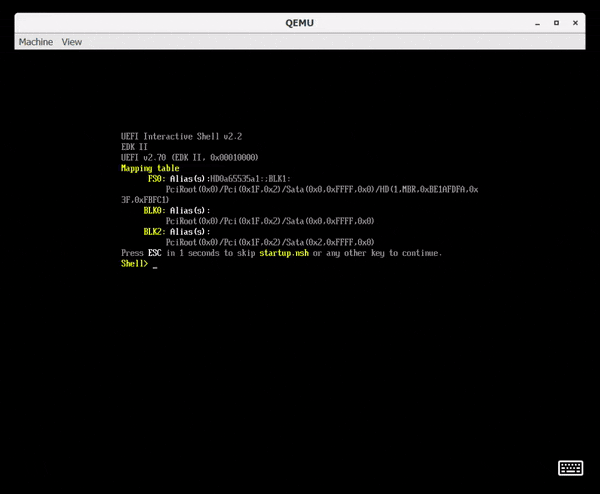

# feature/sbat

This showcases the Secure Boot Advanced Targeting feature (SBAT).
It allows secure boot to specify a version and have rules that can be added to the DB and DBX.

What are you trying to showcase?

Branched from: release/202008

Branched on: Octoeber 23, 2020

Author: Garand Tyson and Matthew Carlson

## What's unique about this branch

This includes a EnrollDefaultKeys and a SecureBoot driver.
This also has two signed and version binaries for testing.
This also includes the mu_basecore that contains the SBAT code.

## Roadmap

- For now, showcase the technology.
- Merge in the SBAT version of mu_basecore
- Add SecureBoot to QemuQ35Pkg

## Expected lifetime of your branch

As the goal of feature branches in `mu_tiano_platforms` is to showcase a feature and allow for development of that feature, we expect this to be done by the next release (release/202012).
