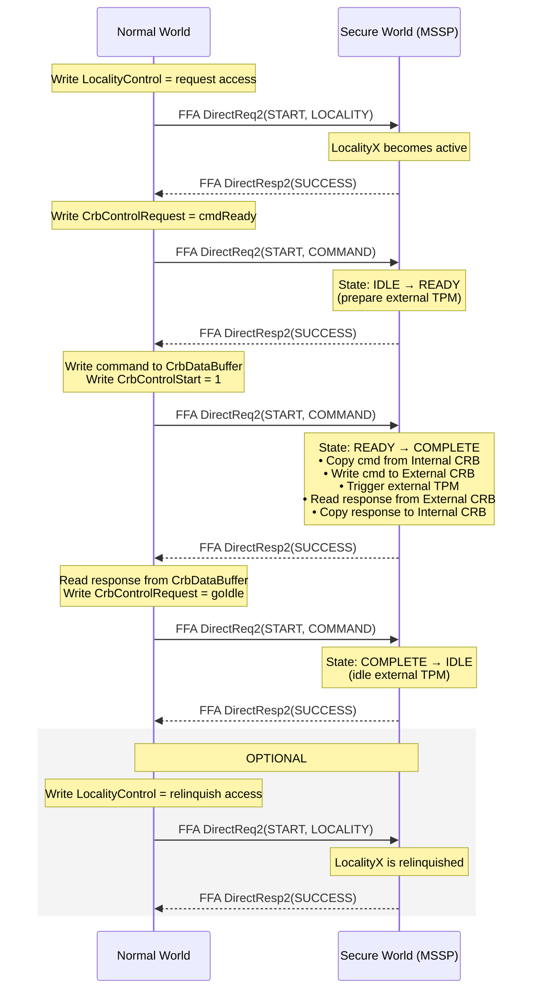

# TPM on QEMU SBSA

This document describes the TPM 2.0 architecture for the QEMU SBSA platform. SBSA uses
a dual-CRB design with an FF-A (Firmware Framework for Arm A-Profile) mediated communication
path between the normal world and the secure world.

Please note that TPM for SBSA is not supported by default and modifications to your QEMU are
required to get TPM support. These changes are planned to be upstreamed in the future.

## Table of Contents

- [Requirements](#requirements)
- [Build Configuration](#build-configuration)
- [Platform Memory Layout](#platform-memory-layout)
- [Architecture Overview](#architecture-overview)
- [Secure Partitions](#secure-partitions)
- [CRB Regions](#crb-regions)
- [FF-A Communication Protocol](#ff-a-communication-protocol)
- [Hash Library Architecture](#hash-library-architecture)
- [Physical Presence Interface](#physical-presence-interface)
- [ACPI Integration](#acpi-integration)
- [swtpm Setup](#swtpm-setup)
- [Communication Flow](#communication-flow)
- [PCDs Reference](#pcds-reference)

## Requirements

| Requirement | Notes |
| ------------- | ------- |
| **Host OS** | Linux (native) or **WSL** on Windows. Native Windows is not supported. |
| **swtpm** | TPM 2.0 emulator. Install via your distro's package manager (e.g. `apt install swtpm swtpm-tools`). |
| **QEMU** | Custom QEMU build with SBSA TPM support (not yet upstreamed — see note above). |
| **Build host** | Same Linux/WSL environment used to run `stuart_build` and launch QEMU. |

See [swtpm Setup](#swtpm-setup) for the full setup commands.

## Build Configuration

The TPM is disabled by default. To enable it, pass the build define and provide the swtpm
socket path or provide it in a BuildConfig.conf file placed at the root level of the repo:

```bash
stuart_build -c Platforms/QemuSbsaPkg/PlatformBuild.py --FlashRom \
  BLD_*_TPM2_ENABLE=TRUE \
  TPM_DEV=/tmp/mytpm1/swtpm-sock
```

The following defines control TPM behavior in `QemuSbsaPkg.dsc`:

| Define | Default | Purpose |
| -------- | --------- | --------- |
| `TPM2_ENABLE` | `FALSE` | Master switch. Guards all TPM drivers, libraries, and PCDs. |
| `TPM2_CONFIG_ENABLE` | `FALSE` | Enables `Tcg2ConfigDxe` HII configuration UI. |

When `TPM2_ENABLE=TRUE`, the build additionally passes `-DTPM2_ENABLE` to the C compiler
via build options, allowing C code to use `#ifdef TPM2_ENABLE` guards.

## Platform Memory Layout

The SBSA platform defines two distinct TPM memory regions:

| Region | Address | Size | Visibility |
| -------- | --------- | ------ | ------------ |
| Internal CRB | `0x100_00200000` | 0x10 pages | Normal world + Secure world |
| External CRB | `0x000_60120000` | 0x10 pages | Secure world only |

The Internal CRB address is published via PCDs:

- `PcdTpmBaseAddress` = `0x10000200000`
- `PcdTpmMaxAddress` = `0x10000204FFF` (5 localities × 0x1000)

The Internal CRB is marked as `EfiACPIMemoryNVS` via a HOB in `SbsaQemuMem.c` so the OS
can locate it through the ACPI TPM2 table.

## Architecture Overview

```mermaid
flowchart TD
    subgraph SEC["SEC Phase"]
        SecNode["<b>Tpm2StartupLib</b><br/>1. Tpm2RequestUseTpm()<br/>2. Tpm2Startup(TPM_SU_CLEAR)"]
    end
    subgraph DXE["DXE Phase"]
        direction TB
        HashDxe["<b>HashLibBaseCryptoRouterDxe + HashInstanceLib*</b><br/>1. Constructors register each enabled hash algorithm<br/>2. Filtered by PcdTpm2HashMask → PcdTcg2HashAlgorithmBitmap"]
        Tcg2Dxe["<b>Tcg2Dxe</b><br/>1. Verify PcdTpmInstanceGuid is TPM 2.0<br/>2. Verify no TpmErrorHob is present<br/>3. Tpm2RequestUseTpm()<br/>4. Query TPM capabilities (Manufacturer, Firmware version, Max cmd/resp size)<br/>5. Get supported/active PCR banks filtered by HashAlgorithmBitmap<br/>6. Decide SupportedEventLogs (TCG_1_2 only if SHA1 active)<br/>7. SetupEventLog (allocate log areas, replay pre-DXE HOBs)<br/>8. Register events (ReadyToBoot, ExitBootServices, ExitBootServices Failed)<br/>9. Register protocol notifies (VariableWriteArch, ResetNotification)<br/>10. Install Tcg2Protocol"]
        Tcg2AcpiFfa["<b>Tcg2AcpiFfa</b><br/>1. Publish TPM2 ACPI table<br/>2. Publish SSDT with TPM0 device node"]
        HashDxe --> Tcg2Dxe --> Tcg2AcpiFfa
    end
    subgraph BDS["BDS Phase"]
        BdsNode["<b>DeviceBootManagerAfterConsole</b><br/>1. Tcg2PhysicalPresenceLibProcessRequest(NULL)<br/>2. Process any pending PP request before shell launch<br/>3. Create TCG2_PHYSICAL_PRESENCE_VARIABLE if missing"]
    end
    subgraph SHELL["UEFI Shell"]
        ShellNode["<b>UEFI Shell / OS / TpmShellApp</b><br/>1. gBS-&gt;LocateProtocol(&amp;gEfiTcg2ProtocolGuid)<br/>2. Tcg2Protocol-&gt;GetCapability / SetActivePcrBanks / etc."]
    end
    SEC --> DXE --> BDS --> SHELL
    SHELL --> DevLib["<b>Tpm2DeviceLibFfa</b><br/>Writes to Internal CRB @ 0x100_00200000<br/>Sends FF-A DirectReq2 to the TpmService"]
    DevLib --> Spmc["<b>EL3: SPMC / TF-A</b><br/>Routes FF-A message to partition 0x8002"]
    subgraph SECURE["Secure World (S-EL1) — MSSP partition 0x8002"]
        direction TB
        TpmSvc["<b>TpmServiceLib</b><br/>State machine: IDLE → READY → COMPLETE → IDLE"]
        TpmXlate["<b>TpmServiceStateTranslationLib</b><br/>Translates CRB-style communication to the style supported by the TPM<br/>(FIFO for QEMU SBSA)<br/>1. Copy command from Internal CRB → local buffer<br/>2. Write command to External CRB @ 0x60120000<br/>3. Trigger execution on external TPM via CRB MMIO<br/>4. Read response from External CRB<br/>5. Copy response back to Internal CRB"]
        TpmSvc --> TpmXlate
    end
    Spmc --> SECURE
    SECURE --> QemuDev["<b>QEMU TPM device</b><br/>MMIO @ 0x60120000"]
    QemuDev --> Swtpm["<b>swtpm process (--tpm2)</b><br/>via Unix socket"]
```



## Secure Partitions

Two FF-A Secure Partitions are involved in TPM operations.

### MSSP — Microsoft Secure Services Partition (id=0x8002)

Configured in `Platforms/QemuSbsaPkg/fdts/qemu_sbsa_mssp_rust_config.dts`:

| Property | Value |
| ---------- | ------- |
| Partition ID | `0x8002` |
| Exception Level | SEL1 |
| Execution State | AARCH64 |
| Load Address | `0x20800000` |
| Image Size | 4 MiB |
| Boot Order | 2 |

The MSSP hosts the TPM service and is granted access to both CRB regions:

```dts
device-regions {
    internal_tpm_crb {
        base-address = <0x100 0x00200000>;
        pages-count = <0x10>;
        attributes = <SECURE_RW>;
    };
    external_tpm_crb {
        base-address = <0x000 0x60120000>;
        pages-count = <0x10>;
        attributes = <SECURE_RW>;
    };
};
```

The MSSP publishes three service UUIDs. The TPM service UUID is:

```text
17b862a4-1806-4faf-86b3-089a58353861
```

Key libraries running inside the MSSP:

- **TpmServiceLib** — handles incoming FF-A messages, implements the CRB state machine
  (IDLE → cmdReady → READY → start → COMPLETE → goIdle → IDLE). Note that this service is
  based on the CRB over FF-A specification released by ARM. See:
  [TPM Service Command Response Buffer Interface Over FF-A](https://developer.arm.com/documentation/den0138/latest/)
- **TpmServiceStateTranslationLib** — translates between the Internal CRB (CRB interface)
  and the External CRB (which may be CRB or FIFO depending on QEMU configuration). On
  QEMU SBSA the external interface is FIFO.

### StMM — Standalone MM Partition (id=0x8001)

Configured in `Platforms/QemuSbsaPkg/fdts/qemu_sbsa_stmm_config.dts`:

| Property | Value |
| ---------- | ------- |
| Partition ID | `0x8001` |
| Exception Level | SEL0 |
| Execution State | AARCH64 |
| Load Address | `0x20002000` |
| Image Size | 3 MiB |
| Boot Order | 0 |

The StMM partition hosts secure variable storage (FTW, VariableRuntimeDxe), and the
`Tcg2StandaloneMmArm` driver which processes Physical Presence Interface commands from
the normal world for NV variable access.

## CRB Regions

### CRB Register Layout (PTP CRB Interface)

Each locality occupies 0x1000 bytes. The CRB register layout is defined by the TCG
PC Client Platform TPM Profile (PTP) specification (and mirrored in `TpmPtp.h`):

- [TCG PC Client Platform TPM Profile (PTP) Specification][ptp-spec] —
  *Section 6 "Command Response Buffer Interface"* describes `LocalityState`,
  `LocalityControl`, `InterfaceId`, `CrbControlRequest`, `CrbControlStart`,
  `CrbControlCommand*`/`CrbControlResponse*`, and the shared `CrbDataBuffer`.

[ptp-spec]: https://trustedcomputinggroup.org/resource/pc-client-platform-tpm-profile-ptp-specification/

### Internal CRB (`0x100_00200000`)

This is the CRB visible to normal-world firmware (DXE drivers and UEFI applications).
`Tpm2DeviceLibFfa` writes TPM commands into this CRB's data buffer and reads responses
from it. The Internal CRB uses the standard CRB register interface. It is the TPM service's
responsibility to setup and maintain this region. The goal is to have this region mimic
a normal MMIO CRB region only with the added caveat that an FF-A message must be sent for
any action to be taken on any register modifications.

The normal-world code performs MMIO writes to the CRB control registers (cmdReady, Start,
goIdle) and then sends FF-A messages to notify the secure partition. The secure partition
reads the command data from the Internal CRB, proxies it to the External CRB, and writes
the response back.

### External CRB (`0x60120000`)

This is the QEMU-emulated TPM device MMIO region. It is **only accessible from the secure
world** i.e. the TPM Service within the MSSP secure partition. On QEMU SBSA, this region
presents a FIFO interface (**not CRB**), which the `TpmServiceStateTranslationLib` handles by
detecting the interface type at initialization and using the appropriate FIFO
command/response protocol (burst-count reads, data register writes).

The external CRB connects to the `swtpm` process through QEMU's chardev/tpmdev
infrastructure:

```text
QEMU args: -chardev socket,id=chrtpm,path=/tmp/mytpm1/swtpm-sock
           -tpmdev emulator,id=tpm0,chardev=chrtpm
```

> **Note**: Unlike Q35, SBSA does **not** add a `-device tpm-tis-device,tpmdev=tpm0`
> argument. As mentioned, QEMU does not support TPM for SBSA directly. Local changes
> are required to get TPM support for SBSA. See QemuCommandBuilder.py and QemuRunner.py
> for details on the swtpm commands.

## FF-A Communication Protocol

All TPM commands from normal world to secure world use FF-A Direct Request/Response
messaging (FFA_MSG_SEND_DIRECT_REQ2 / FFA_MSG_SEND_DIRECT_RESP2) to/from the TPM Service.

### Service Discovery

On first use, `Tpm2DeviceLibFfa` discovers the TPM service partition:

```c
ArmFfaLibGetPartitionInfo(&gTpm2ServiceFfaGuid, &TpmPartInfo);
```

This queries the SPMC (EL3) for the partition hosting UUID `17b862a4-1806-4faf-86b3-089a58353861`,
which returns partition ID `0x8002`. This information can be found in the manifest of the secure
partition.

### Function IDs

| ID | Name | Direction | Supported |
| ---- | ------ | ----------- | ----------- |
| `0x0f000001` | `TPM2_FFA_GET_INTERFACE_VERSION` | NW → SW | YES |
| `0x0f000101` | `TPM2_FFA_GET_FEATURE_INFO` | NW → SW | NO |
| `0x0f000201` | `TPM2_FFA_START` | NW → SW | YES |
| `0x0f000301` | `TPM2_FFA_REGISTER_FOR_NOTIFICATION` | NW → SW | NO |
| `0x0f000401` | `TPM2_FFA_UNREGISTER_FROM_NOTIFICATION` | NW → SW | NO |
| `0x0f000501` | `TPM2_FFA_FINISH_NOTIFIED` | NW → SW | NO |
| `0x1f000001` | `TPM2_FFA_MANAGE_LOCALITY` | TF-A → SW only | YES |

The `TPM2_FFA_START` function carries a qualifier in Arg1:

| Qualifier | Value | Purpose |
| ----------- | ------- | --------- |
| `TPM2_FFA_START_FUNC_QUALIFIER_COMMAND` | `0x0` | Execute a CRB state transition (cmdReady, start, or goIdle) |
| `TPM2_FFA_START_FUNC_QUALIFIER_LOCALITY` | `0x1` | Request or relinquish locality access |

The `TPM2_FFA_MANAGE_LOCALITY` function carries a qualifier in Arg1:

| Qualifier | Value | Purpose |
| ----------- | ------- | --------- |
| `TPM2_FFA_MANAGE_LOCALITY_OPEN` | `0x0` | Allows access to a locality |
| `TPM2_FFA_MANAGE_LOCALITY_CLOSE` | `0x1` | Prevents access to a locality |

Note that for both `TPM2_FFA_START` and `TPM2_FFA_MANAGE_LOCALITY` Arg2 specifies
the locality to take action upon.

### FF-A Message Sequence (Per TPM Command)

A locality **must** first be requested before any commands can be sent to
the TPM via that locality's CRB region. The active locality **must** be
relinquished before another locality is requested. The current entity
engaging with the TPM must take the responsibility of relinquishing the
active locality when they are no longer using it. If the locality being
requested is 'CLOSED', a DENIED error is returned. If the locality being
relinquished is not the current active locality, a DENIED error is returned.

A single TPM command requires multiple FF-A round trips:



If the secure partition is preempted by a non-secure interrupt during processing, the FF-A
call returns `EFI_INTERRUPT_PENDING`. The normal-world code handles this by calling
`ArmFfaLibRun()` in a loop until the operation completes. Note that this can only happen
if ns-interrupts-action in the secure partition's manifest is set to 0x02, otherwise, the
non-secure interrupt is queued and the service will continue execution until it completes
or responds with a YIELD.

## Hash Library Architecture

Tcg2Dxe uses `HashLibBaseCryptoRouterDxe` with all hash instance libraries included.

### Registration Flow

1. `HashLibBaseCryptoRouterConstructor` resets `PcdTcg2HashAlgorithmBitmap` to 0.
2. Each `HashInstanceLib` constructor calls `RegisterHashInterfaceLib()`.
3. `RegisterHashInterfaceLib()` checks the algorithm against `PcdTpm2HashMask` (`0x02` =
   SHA256 only). Algorithms not in the mask return `EFI_UNSUPPORTED`.

### Hash Algorithm Bitmask Values

The bit positions used in `PcdTpm2HashMask`, `PcdTcg2HashAlgorithmBitmap`, and the
`EFI_TCG2_BOOT_SERVICE_CAPABILITY.HashAlgorithmBitmap` field are defined by the EFI
TCG2 protocol and the TCG algorithm registry:

- [UEFI TCG2 Protocol Specification][tcg2-proto] — see `EFI_TCG2_BOOT_HASH_ALG_*`
  (`SHA1` = BIT0, `SHA256` = BIT1, `SHA384` = BIT2, `SHA512` = BIT3, `SM3_256` = BIT4).
- [TCG Algorithm Registry][tcg-algreg] — canonical list of TPM hash algorithm IDs.

For this platform, `PcdTpm2HashMask = 0x02` enables SHA256 only.

[tcg2-proto]: https://trustedcomputinggroup.org/resource/tcg-efi-protocol-specification/
[tcg-algreg]: https://trustedcomputinggroup.org/resource/tcg-algorithm-registry/

### Filtering Chain

```text
PcdTpm2HashMask (0x02)
        │
        ▼
RegisterHashInterfaceLib() ── gates which HashInstanceLibs register
        │
        ▼
PcdTcg2HashAlgorithmBitmap ── result of all successful registrations
        │
        ▼
Tcg2Dxe intersects with TPM-reported capabilities
        │
        ▼
Final ActivePcrBanks / HashAlgorithmBitmap in EFI_TCG2_BOOT_SERVICE_CAPABILITY
```

## Physical Presence Interface

### Library Selection

| `TPM2_ENABLE` | Library | Behavior |
| --------------- | --------- | ---------- |
| `FALSE` | `Tcg2PhysicalPresenceLibNull` | All functions stubbed |
| `TRUE` | `DxeTcg2PhysicalPresenceMinimumLib` | Auto-confirms Clear; rejects all other operations |

The MinimumLib implementation:

- **Auto-confirms** TPM Clear operations without user prompting.
- **Rejects** SET_PCR_BANKS, LOG_ALL_DIGESTS, and other operations with
  `TCG_PP_RETURN_TPM_OPERATION_RESPONSE_FAILURE`.
- Does **not** create or use `TCG2_PHYSICAL_PRESENCE_FLAGS_VARIABLE`.

### ProcessRequest in BDS

`Tcg2PhysicalPresenceLibProcessRequest()` is invoked from the platform's
`DeviceBootManagerLib` during `DeviceBootManagerAfterConsole()`, before the shell
launches. It:

1. Reads the `Tcg2PhysicalPresence` NV variable (creates it if missing).
2. Executes any pending PP request stored in the variable.
3. Stores the result back for `ReturnOperationResponseToOsFunction()` to report.

### Tcg2StandaloneMmArm (Secure World)

The `Tcg2StandaloneMmArm` driver runs in the StMM partition (id=0x8001). It handles
Physical Presence NV variable operations when called from the DXE-phase PP library via
MM communicate. This is necessary because NV variable writes go through the secure
variable store in StMM.

## ACPI Integration

### TPM2 ACPI Table

Published by `Tcg2AcpiFfa.c`:

| Field | Value |
| ------- | ------- |
| Start Method | CRB with FF-A (`0x0C`) |
| Control Area Address | `PcdTpmBaseAddress + 0x40` |
| Command Buffer | `PcdTpmBaseAddress + 0x80`, size `0xF80` |
| Response Buffer | `PcdTpmBaseAddress + 0x80`, size `0xF80` |
| Platform Parameters | Partition ID from `PcdTpmServiceFfaPartitionId` |

### TPM ACPI Device (SSDT)

An SSDT is published with a `TPM0` device node containing:

- `_HID` patched with the TPM manufacturer ID read from hardware.
- `_CRS` with a QWordMemory resource pointing to `PcdTpmBaseAddress` through
  `PcdTpmMaxAddress`.
- `_DSM` implementing TCG PPI operations 1–8 for OS-initiated Physical Presence requests.
- An `FFixedHw` OperationRegion for FF-A DirectReq2 passthrough from the OS.

## swtpm Setup

### Installation

swtpm requires Unix sockets, so it must run in a Linux environment. On Windows,
use [WSL](https://learn.microsoft.com/en-us/windows/wsl/install) (Windows
Subsystem for Linux).

```bash
# Windows (from a WSL terminal)
wsl --install          # if WSL is not yet enabled
wsl                    # enter the WSL environment

# Ubuntu/Debian (native or WSL)
sudo apt install swtpm swtpm-tools

# Fedora
sudo dnf install swtpm swtpm-tools
```

### Manual Setup

Create the TPM state directory and start swtpm before launching QEMU:

```bash
mkdir -p /tmp/mytpm1
swtpm socket \
  --tpmstate dir=/tmp/mytpm1 \
  --ctrl type=unixio,path=/tmp/mytpm1/swtpm-sock \
  --tpm2 \
  --log level=20
```

### Automatic Setup (QemuRunner)

When the `TPM_DEV` environment variable is set, `QemuRunner.py` automatically starts
swtpm in a background thread before launching QEMU:

```python
# Platforms/QemuSbsaPkg/Plugins/QemuRunner/QemuRunner.py
@staticmethod
def RunThread(env):
    tpm_path = env.GetValue("TPM_DEV")
    tpm_cmd = "swtpm"
    tpm_args = (
        f"socket --tpmstate dir={'/'.join(tpm_path.rsplit('/', 1)[:-1])} "
        f"--ctrl type=unixio,path={tpm_path} --tpm2 --log level=20"
    )
    utility_functions.RunCmd(tpm_cmd, tpm_args)
```

The thread is launched before QEMU starts and joined after QEMU exits. The user is
prompted to press Ctrl+C to terminate swtpm at shutdown.

### QEMU Arguments

The `QemuCommandBuilder.with_tpm()` method adds:

```text
-chardev socket,id=chrtpm,path=/tmp/mytpm1/swtpm-sock
-tpmdev emulator,id=tpm0,chardev=chrtpm
```

## Communication Flow

Complete path from a shell application to swtpm:

```text
TpmShellApp (UEFI Shell)
  │ gBS->LocateProtocol(&gEfiTcg2ProtocolGuid)
  │ Tcg2Protocol->SetActivePcrBanks(0x02)
  ▼
Tcg2Dxe (EFI_TCG2_PROTOCOL)
  │ Validates bank mask against HashAlgorithmBitmap
  │ Calls Tcg2PhysicalPresenceLibSubmitRequestToPreOSFunction()
  │   ├── MinimumLib: rejects SET_PCR_BANKS → returns EFI_UNSUPPORTED
  │   └── MinimumLib: NO_ACTION (already-active) → writes to NV variable → EFI_SUCCESS
  ▼
Tpm2CommandLib (for direct TPM commands like GetCapability)
  │ Serializes TPM2_CC command structure into byte buffer
  │ Calls Tpm2SubmitCommand(cmdBuffer, cmdSize, rspBuffer, &rspSize)
  ▼
Tpm2DeviceLibFfa — FfaTpm2SubmitCommand()
  │ PtpCrbTpmCommand(CrbReg = PcdTpmBaseAddress)
  │
  │ ┌─ STEP 1: cmdReady ──────────────────────────────────────────┐
  │ │  MmioWrite32(&CrbReg->CrbControlRequest, PTP_CRB_CONTROL    │
  │ │              _AREA_REQUEST_COMMAND_READY)                   │
  │ │  Tpm2ServiceStart(QUALIFIER_COMMAND, 0) ── FF-A ──► MSSP    │
  │ └─────────────────────────────────────────────────────────────┘
  │
  │ ┌─ STEP 2: submit ────────────────────────────────────────────┐
  │ │  CopyMem(CrbReg->CrbDataBuffer, cmdBuffer, cmdSize)         │
  │ │  MmioWrite32(&CrbReg->CrbControlStart, 1)                   │
  │ │  Tpm2ServiceStart(QUALIFIER_COMMAND, 0) ── FF-A ──► MSSP    │
  │ └─────────────────────────────────────────────────────────────┘
  │
  │                    ════ WORLD SWITCH ════
  │
  │   MSSP (secure world, partition 0x8002):
  │     TpmServiceLib: state READY → execute
  │     TpmServiceStateTranslationLib:
  │       1. Read command from Internal CRB data buffer
  │       2. CopyCommandData() → write to External CRB @ 0x60120000 (FIFO)
  │       3. StartCommand() → trigger TPM execution
  │       4. CopyResponseData() → read response from External CRB
  │       5. Write response to Internal CRB data buffer
  │
  │                    ════ QEMU MMIO ════
  │
  │     QEMU TPM device @ 0x60120000
  │       └── Unix socket ──── swtpm process
  │
  │                    ════ WORLD SWITCH BACK ════
  │
  │ ┌─ STEP 3: goIdle ────────────────────────────────────────────┐
  │ │  Read response from CrbReg->CrbDataBuffer                   │
  │ │  MmioWrite32(&CrbReg->CrbControlRequest, PTP_CRB_CONTROL    │
  │ │              _AREA_REQUEST_GO_IDLE)                         │
  │ │  Tpm2ServiceStart(QUALIFIER_COMMAND, 0) ── FF-A ──► MSSP    │
  │ └─────────────────────────────────────────────────────────────┘
  ▼
Response returned to caller
```

## PCDs Reference

### Required PCDs (set when TPM2_ENABLE=TRUE)

| PCD | Value | Type | Purpose |
| ----- | ------- | ------ | --------- |
| `PcdTpmBaseAddress` | `0x10000200000` | FixedAtBuild | Internal CRB base address |
| `PcdTpmMaxAddress` | `0x10000204FFF` | FixedAtBuild | Internal CRB end address (5 localities) |
| `PcdTpm2HashMask` | `0x02` | DynamicDefault | Hash algorithm filter (SHA256 only) |
| `PcdTpmInstanceGuid` | `gEfiTpmDeviceInstanceTpm20DtpmGuid` | FixedAtBuild | Selects discrete TPM 2.0 device type |
| `PcdTpm2AcpiTableRev` | `4` | DynamicHii | ACPI TPM2 table revision |
| `PcdUserPhysicalPresence` | `FALSE` | FixedAtBuild | No physical user presence assertion |

### Memory Type PCDs

| PCD | Value | Purpose |
| ----- | ------- | --------- |
| `PcdMemoryTypeEfiACPIReclaimMemory` | `0x143` | ACPI reclaim memory pages (includes TPM ACPI tables) |
| `PcdMemoryTypeEfiACPIMemoryNVS` | `0x3C` | ACPI NVS pages (includes CRB region) |
| `PcdMemoryTypeEfiRuntimeServicesData` | `0x642` | Runtime services data pages |
| `PcdMemoryTypeEfiRuntimeServicesCode` | `0x424` | Runtime services code pages |
| `PcdMemoryTypeEfiReservedMemoryType` | `0x505` | Reserved memory pages |

### Conditional PCDs (TPM2_CONFIG_ENABLE=TRUE)

| PCD | Value | Purpose |
| ----- | ------- | --------- |
| `PcdTcgPhysicalPresenceInterfaceVer` | `"1.3"` | TCG PPI specification version reported to OS |
